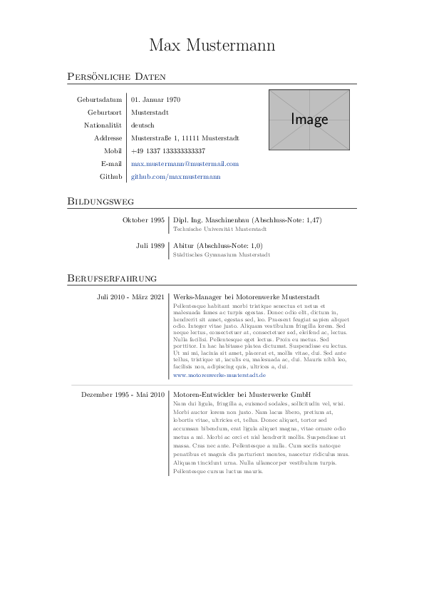
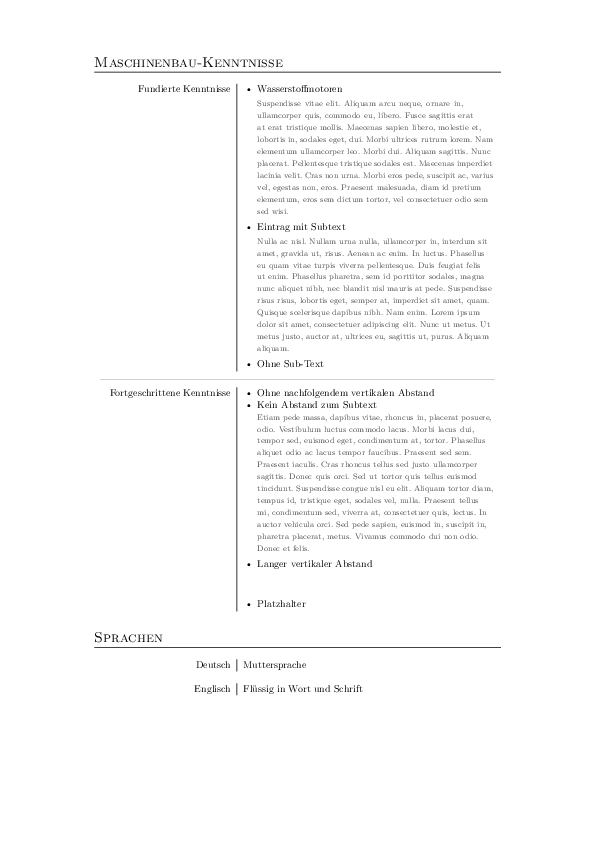

# latex-cv

Curriculum vitae written in LaTeX.

Output of the example provided in the .tex file:

  

## Usage

1. Get a copy of TeX Live (https://tug.org/texlive/)
  - If custom installation, required packages are:
    - array
    - enumitem
    - fontspec
    - graphicx
    - hyperref
    - layouts
    - paralist
    - titlesec
    - url
    - wrapfig
    - xcolor
    - xltxtra
    - xparse (>=2021/03)
    - xunicode
  - Example contents additionally need:
    - babel
    - blindtext
    - lipsum
    - mwe
1. Download `curriculum-vitae.tex` from this repository
1. Run XeLaTeX to produce a PDF file from the source TeX-file
  - If you are on Windows:
    1. Go to the `bin` folder in your TeX Live installation path and run the
       executable called `TeXworks.exe`
    1. Open `curriculum-vitae.tex` in the editor that should have opened after
       the first step
    1. On the left top in the drop down menu select `XeLaTeX`
    1. Click on the green triangle pointing towards the drop down menu
    1. Enjoy the newly created PDF file
    1. You might need to run this step up to 3 times for a finalized result
       (blame refs within the document)
  - If you are on Linux:
    1. Open a terminal emulator of your choice (gnome-terminal, mate-terminal,
       etc)
    1. In the terminal, navigate into the directory where you downloaded the
       TeX source file
    1. Run
       ```
       xelatex curriculum-vitae.tex
       xelatex curriculum-vitae.tex
       xelatex curriculum-vitae.tex
       ```
    1. Open and enjoy the created PDF either via your preferred folder viewer
       or run `xdg-open curriculum-vitae.pdf`

## License and Copyright

Copyright (c) 2021 Maximilian Schott

Licensed under GPLv3, see LICENSE file within this repository
